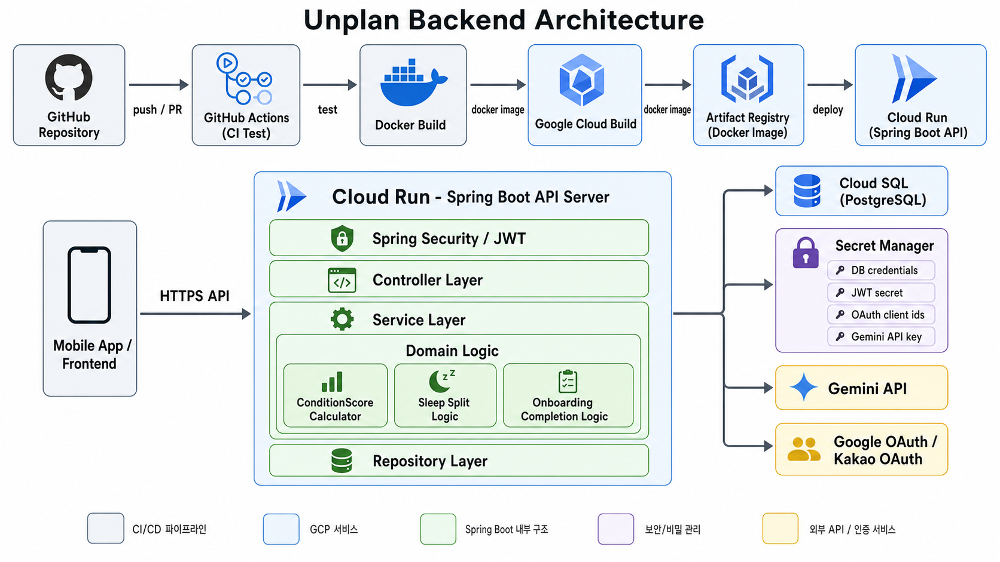

# Unplan Backend


> 컨디션과 일정 흐름 사이의 문제를 해결하는 스케줄러 앱

<br />

## Architecture



<br />

## API Docs

| 구분 | URL |
|------|-----|
| Local Swagger | `http://localhost:8080/swagger-ui/index.html` |
| Dev Swagger | `https://dev-api.un-plan.com/swagger-ui.html` |

> 운영 환경에서는 Swagger UI와 OpenAPI docs가 비활성화되어 있습니다.

<br />

## 주요 기능

### 컨디션 기록

사용자는 Body/Mind 점수를 기록할 수 있습니다.  
기록된 컨디션 데이터는 하루 컨디션 점수, 컨디션 상태 문구, 컨디션 태그 산정에 사용됩니다.

### 수면 기록

사용자는 수면, 낮잠, 밤샘 기록을 등록할 수 있습니다.  
24시간을 초과하는 연속 수면은 날짜별 수면 기록으로 나누어 조회되며, 수정/삭제 시 하나의 연속 수면 기록으로 함께 처리됩니다.

### 하루 기록 조회

특정 날짜의 컨디션 기록과 수면 기록을 함께 조회할 수 있습니다.  
Body/Mind 기록 목록과 수면 기록 목록은 각각 페이징되어 반환됩니다.

### 평균 보기

사용자는 일별, 주별, 월별 기준으로 컨디션 평균 흐름을 조회할 수 있습니다.  
평균 보기에서는 최종 컨디션 점수, Body/Mind 퍼센트, 수면 점수, 수면 시간을 제공합니다.

### 온보딩

사용자의 수면 목표, 바이오리듬, 회복 조건 등 초기 설정 정보를 저장합니다.  
온보딩 데이터는 컨디션 점수 계산과 일정 추천에 활용됩니다.

### 일정 추천

사용자의 컨디션 상태와 태그를 기반으로 일정 추천에 필요한 데이터를 제공합니다.  
Gemini API를 활용한 추천 기능과 연동됩니다.

<br />

## 기술 스택

### Backend

- **Java**
- **Spring Boot**
- **Spring Web MVC**
- **Spring Security**
- **Spring Data JPA**
- **Spring Validation**
- **JWT**

### Database

- **PostgreSQL**
- **H2** - Test Database

### Infra / DevOps

- **Docker**
- **GitHub Actions**
- **Google Cloud Platform**
    - **Cloud Run**
    - **Cloud SQL**
    - **Cloud Build**
    - **Artifact Registry**
    - **Secret Manager**

### External API

- **Google OAuth**
- **Kakao OAuth**
- **Gemini API**

### API Docs

- **Springdoc OpenAPI**
- **Swagger UI**

<br />

## 프로젝트 구조

```text
src/main/java/com/unplan/unplanserver/
  UnplanServerApplication.java

  domain/
    auth/             # 인증, 소셜 로그인
    jwt/              # JWT 발급 및 검증
    measurement/      # 컨디션/수면 기록, 평균 조회
    member/           # 회원, 프로필
    memo/             # 메모
    onboarding/       # 온보딩 설정
    recommendation/   # 일정 추천
    schedule/         # 일정 관리
    setting/          # 설정

  global/
    common/           # 공통 상수 및 유틸성 코드
    config/           # 공통 설정
    entity/           # Base Entity 설정
    exception/        # 예외 처리
    filter/           # JWT 필터
    response/         # 공통 응답
    
  util/               # 공통 유틸

  webclient/          # 외부 API 연동 클라이언트
```

<br />

## 시작하기

### 요구사항

- Java 21
- Docker
- PostgreSQL
- Gradle Wrapper 사용 권장

### 설치

```bash
git clone https://github.com/unplan-tave/unplan-server.git
cd unplan-server
```

### 로컬 실행

로컬 기본 프로필은 `local`입니다. PostgreSQL이 필요하며, `docker-compose.yml`로 로컬 DB와 앱을 함께 실행할 수 있습니다.

```bash
docker compose up -d postgres
```

애플리케이션을 직접 실행할 때는 최소한 다음 환경변수를 설정합니다.

```bash
export JWT_SECRET=your-local-jwt-secret
export GOOGLE_CLIENT_ID=your-google-client-id
```

Gemini 연동 기능을 사용할 경우 다음 값도 설정합니다.

```bash
export GEMINI_API_KEY=your-gemini-api-key
```

```bash
./gradlew bootRun
```

Docker Compose로 앱까지 함께 실행할 수도 있습니다.

```bash
docker compose up --build
```

### 테스트

```bash
./gradlew test
```

특정 테스트만 실행할 때는 다음 형식을 사용합니다.

```bash
./gradlew test --tests com.unplan.unplanserver.domain.measurement.*
```

<br />

## 팀원

| 이름  | GitHub | 담당                   |
|-----|--------|----------------------|
| 강승구 | [@SeungKu-Kang](https://github.com/SeungKu-Kang) | 일정 / 일정 추천 / 태그      |
| 이지영 | [@young0206](https://github.com/young0206) | 인프라 / 온보딩 / 컨디션      |
| 한근형 | [@hangeunhyeong](https://github.com/hangeunhyeong) | 인증인가 / AI 태그 추천 / 알림 |

<br />

## 개발 규칙

- 기능은 기존 `domain/*` 패키지 구조를 따릅니다.
- 공통 응답과 예외 처리는 `global/`의 기존 규칙을 우선 사용합니다.
- 민감한 값은 커밋하지 않고 환경 변수 또는 Secret Manager로 관리합니다.
- DB 스키마 변경이 필요한 경우 배포 환경 반영 여부를 확인합니다.
- 비즈니스 계산 로직은 중복 작성하지 않고 공통 계산 클래스를 재사용합니다.

<br />

## Convention

### Branch

```text
<type>/<description>-#<issue_number>
```

예시:

```text
feat/sleep-record-#12
fix/token-refresh-#24
refactor/condition-score-#35
```

### Commit

```text
<type>: <subject> (#<issue_number>)
```

예시:

```text
feat: 수면 기록 API 구현 (#12)
fix: 토큰 재발급 오류 수정 (#24)
refactor: 컨디션 점수 계산 로직 분리 (#35)
```

### Type

| Type | 설명 |
|------|------|
| `feat` | 새로운 기능 |
| `fix` | 버그 수정 |
| `refactor` | 리팩토링 |
| `docs` | 문서 수정 |
| `test` | 테스트 코드 |
| `chore` | 빌드, 설정, 기타 작업 |
